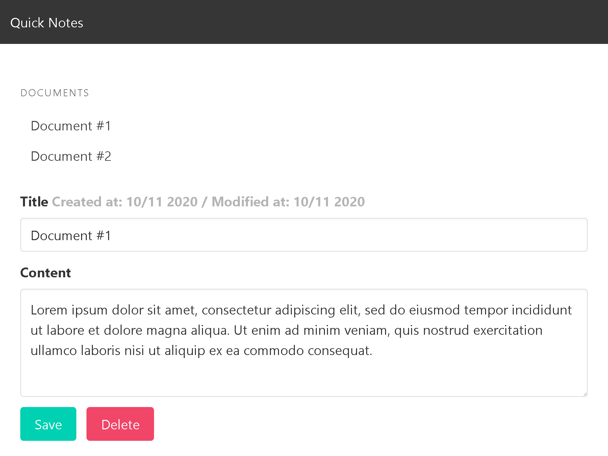

<h1 align = "center">
 
  
   
     
  Quick Notes
   
</ H1>

<h3 align = "center"> Python/Django App</h3>

## Requirements

Refer to `requirements.txt` file

## Project Specifications

- CRUD (create, read, update and delete)